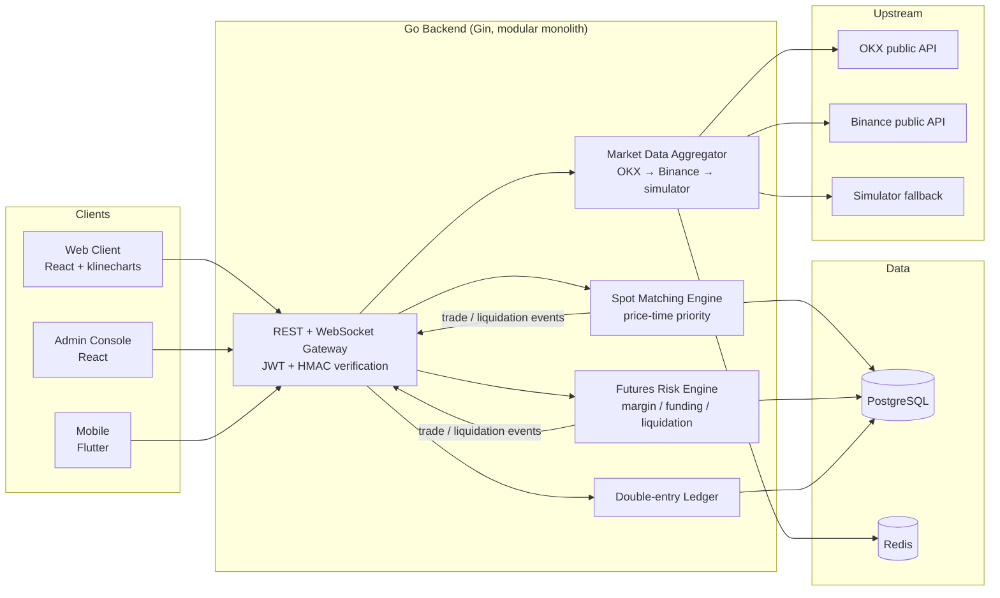

<div align="center">

# CryptoSim

**A production-grade paper-trading crypto exchange — spot & perpetual futures on real market data, with 100% virtual funds.**

[](https://github.com/moonljt521/byBit/actions/workflows/ci.yml)


[中文文档](README.zh-CN.md) | English | [Setup Guide](docs/SETUP.md) | [API Reference](docs/openapi.yaml) | [Deployment](deploy/README.md)

</div>

> ⚠️ **Disclaimer** — Educational project. All funds are virtual; there are no real deposit, withdrawal, or transfer channels. Nothing here constitutes investment advice.

## Overview

CryptoSim replicates the architecture of a production crypto exchange — matching engine, double-entry ledger, derivatives risk engine, admin console — so that building and operating it **is** the lesson about how exchanges and crypto work. Market data is real (OKX/Binance public feeds); matching, accounting, and risk logic are faithful simulations; funds are 100% virtual.

### Highlights

| Domain | Capabilities |
|---|---|
| Market Data | 3-level fallback (OKX → Binance → built-in simulator), candlesticks 1m–1d, 10-level order book, live trades, Redis caching, upstream circuit breaker |
| Spot | Limit / market / trigger (stop-loss & take-profit) orders, Post-Only, partial fills with dust sweeping, fund freeze/unfreeze, 0.1% taker fee, 5 USDT min notional, idempotent order placement |
| Futures | USDT-margined perpetuals (isolated), 1–20x leverage, long/short, mark price, funding rate settled every 8h, liquidation engine at 0.5% maintenance margin |
| Ledger | Double-entry bookkeeping — every balance mutation produces an auditable entry with balance snapshot |
| Security | JWT identity + HMAC-SHA256 request signing (anti-tamper / anti-replay), AES-256-GCM encrypted API secrets at rest, per-IP rate limiting, login audit trail, bcrypt passwords |
| Admin | RBAC console: ops dashboard, user management, virtual fund adjustments, global audit trail |
| Learning | 8 coin wikis, 12 beginner tutorials, 46-term glossary |
| Realtime | WebSocket broadcast (tickers) + private trade notifications, auto-reconnect |

## Architecture



## Quick Start

Prerequisites: [Go 1.22+](https://go.dev), [Node.js 18+](https://nodejs.org), PostgreSQL 14+, Redis 7+. Full provisioning guide for a fresh machine: **[docs/SETUP.md](docs/SETUP.md)**.

```bash
git clone git@github.com:moonljt521/byBit.git && cd byBit

# 1. Start local PG / Redis (macOS/Homebrew; see docs/SETUP.md for Linux)
make services-start

# 2. Bootstrap database (first time only)
make db-init

# 3. Backend on :8080 (auto-migrates schema; set SIM_HTTP_PROXY for OKX access in CN networks)
cd backend && SIM_HTTP_PROXY=http://127.0.0.1:26002 go run ./cmd/server

# 4. Web client on :5173 (new terminal)
cd frontend && npm install && npm run dev

# 5. Admin console on :5174 (optional)
cd admin && npm install && npm run dev
```

Built-in accounts: `demo / demo12345` · `admin / admin12345`.

## Mobile

```bash
cd mobile
flutter pub get
flutter build apk --debug   # build/app/outputs/flutter-apk/app-debug.apk
flutter run                 # or run on a connected device
```

Point the app at your backend via the server icon on the login page — it supports **one-tap LAN server discovery**, and the app auto-reconnects when the host IP changes.

## Testing & Performance

```bash
cd backend && go test ./... -race          # matching engine (10), futures engine (8), auth/JWT
cd frontend && npm run build               # type-check + production build (same for admin/)
cd mobile  && flutter analyze && flutter test
cd e2e     && npx playwright test          # 7 end-to-end cases (4 web + 3 admin)
```

| Benchmark | Throughput |
|---|---|
| Order placement (validate → freeze → persist → ledger) | ≈ 8,700 orders/sec |
| Ledger write path (freeze + credit + entries) | ≈ 9,000 ops/sec |
| Engine scan over 500 resting orders | 3.6 ms |

## Production Deployment

`deploy/` contains a TLS-terminating nginx config (HSTS, CSP, WebSocket proxy), a hardened `docker-compose.prod.yml` (only 80/443 exposed, mandatory secrets), and a security baseline checklist covering keys, certificates, and backups. See **[deploy/README.md](deploy/README.md)**.

> Required secrets in production: `SIM_JWT_SECRET`, `SIM_ENC_KEY` (`openssl rand -hex 32`), `POSTGRES_PASSWORD`, `SIM_ALLOWED_ORIGINS`.

## API

Full OpenAPI 3.0 spec: [docs/openapi.yaml](docs/openapi.yaml). All private endpoints require **JWT + HMAC-SHA256 request signing** (spec documented at the top of the file). Monitoring exposed at `/metrics` (Prometheus format).

## Project Layout

```
byBit/
├── backend/    Go backend (Gin + GORM; modular monolith)
├── frontend/   Web client (React 18 + TS + AntD + klinecharts)
├── admin/      Admin console (React 18 + TS + AntD)
├── mobile/     Flutter client (Android / iOS)
├── content/    Learning center content (Markdown)
├── deploy/     Production deployment templates
├── docs/       Setup guide / user manual / OpenAPI
└── e2e/        Playwright end-to-end tests
```

## Tech Rationale

Benchmarked against real exchanges: Bybit's backend is primarily **Go**, Binance runs Java services with a C++ matching core, and all major web frontends are React; public chain clients are C++ (Bitcoin Core), Go (Geth), and Java (java-tron). CryptoSim implements exchange-equivalent matching, accounting, and risk logic in Go — same architecture, same lessons.

## Documentation

| Document | Content |
|---|---|
| [docs/SETUP.md](docs/SETUP.md) | Fresh-machine provisioning (services, install commands, DB bootstrap) |
| [docs/使用说明.md](docs/使用说明.md) | Beginner-friendly user manual (Chinese) |
| [docs/openapi.yaml](docs/openapi.yaml) | OpenAPI 3.0 API reference incl. signing spec |
| [deploy/README.md](deploy/README.md) | Production deployment & security baseline |

## License

[MIT](LICENSE)
