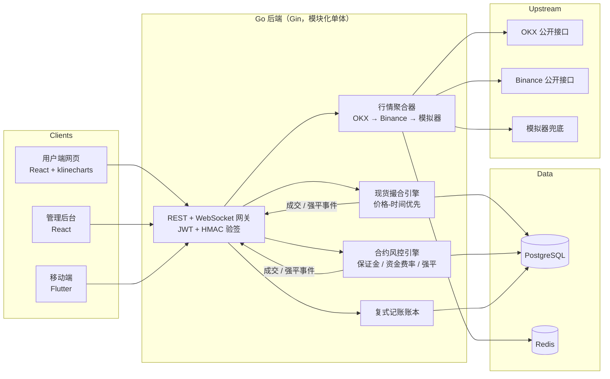

# CryptoSim — 虚拟加密货币交易所（模拟盘）

[English](README.md) | **中文**

一个**流程与真实交易所一致、资金全部虚拟**的模拟加密货币交易所（对标 Bybit 的产品形态）：真实行情 + 仿真撮合/合约风控 + 学习中心 + 管理后台 + 移动客户端。

> ⚠️ **免责声明** —— 仅供学习研究：所有资金均为虚拟资金，无任何真实充值、提币、转账通道，不构成任何投资建议。

## 概览

CryptoSim 复刻了生产级交易所的架构——撮合引擎、复式记账账本、衍生品风控引擎、管理后台——**搭建和运营它的过程，就是学习交易所与虚拟币运作原理的过程**。行情是真实的（OKX/Binance 公开接口）；撮合、账务、风控逻辑为忠实仿真；资金 100% 虚拟。

### 核心能力

| 领域 | 能力 |
|---|---|
| 行情数据 | 三级降级（OKX → Binance → 内置模拟器）、K 线 1m–1d、十档盘口、实时成交、Redis 缓存 + 上游熔断 |
| 现货 | 限价 / 市价 / 条件单（止损止盈）、Post-Only、分批成交与尾单清扫、资金冻结解冻、0.1% taker 费率、最小名义价值 5 USDT、下单幂等 |
| 合约 | USDT 本位永续（逐仓）、1–20x 杠杆、多空双向、标记价格、每 8h 资金费率结算、0.5% 维持保证金率触发强平 |
| 账本 | 复式记账——每笔余额变动均产生带余额快照的可审计流水 |
| 安全 | JWT 身份 + HMAC-SHA256 请求验签（防篡改 / 防重放）、API Secret AES-256-GCM 加密落库、IP 限流、登录审计、bcrypt 密码 |
| 管理后台 | RBAC 控制台：运营看板、用户管理、虚拟资金调拨、全局审计流水 |
| 学习中心 | 8 篇币种百科、12 篇新手教程、46 条术语词典 |
| 实时推送 | WebSocket 广播（行情）+ 私有成交通知，断线自动重连 |

## 架构



## 快速开始

前置依赖：[Go 1.22+](https://go.dev)、[Node.js 18+](https://nodejs.org)、PostgreSQL 14+、Redis 7+。新机器完整装机指南见 **[docs/SETUP.md](docs/SETUP.md)**。

```bash
git clone git@github.com:moonljt521/byBit.git && cd byBit

# 1. 启动本地 PG / Redis（macOS/Homebrew；Linux 见 docs/SETUP.md）
make services-start

# 2. 初始化数据库（仅首次）
make db-init

# 3. 启动后端 :8080（自动迁移建表；国内网络设 SIM_HTTP_PROXY 访问 OKX）
cd backend && SIM_HTTP_PROXY=http://127.0.0.1:26002 go run ./cmd/server

# 4. 用户端 :5173（新终端）
cd frontend && npm install && npm run dev

# 5. 管理后台 :5174（可选）
cd admin && npm install && npm run dev
```

内置账号：`demo / demo12345` · `admin / admin12345`。

## 移动端

```bash
cd mobile
flutter pub get
flutter build apk --debug   # build/app/outputs/flutter-apk/app-debug.apk
flutter run                 # 或运行在连接的设备上
```

通过登录页的服务器图标配置后端地址——支持**一键自动搜索局域网服务器**，主机 IP 变化时 App 会自动扫描重连。

## 测试与性能

```bash
cd backend && go test ./... -race          # 撮合引擎(10) + 合约引擎(8) + 认证/JWT
cd frontend && npm run build               # 类型检查 + 生产构建（admin/ 同）
cd mobile  && flutter analyze && flutter test
cd e2e     && npx playwright test          # 7 个端到端用例（用户端 4 + 管理后台 3）
```

| 基准 | 吞吐 |
|---|---|
| 下单全链路（校验→冻结→落库→流水） | ≈ 8,700 单/秒 |
| 账本写路径（冻结+入账+流水） | ≈ 9,000 ops/秒 |
| 引擎扫描 500 条挂单 | 3.6 ms |

## 生产部署

`deploy/` 包含 TLS 终止 nginx 配置（HSTS、CSP、WebSocket 反代）、加固的 `docker-compose.prod.yml`（仅暴露 80/443、强制注入密钥）以及覆盖密钥、证书、备份的安全基线自查表。见 **[deploy/README.md](deploy/README.md)**。

> 生产必需密钥：`SIM_JWT_SECRET`、`SIM_ENC_KEY`（`openssl rand -hex 32`）、`POSTGRES_PASSWORD`、`SIM_ALLOWED_ORIGINS`。

## API

完整 OpenAPI 3.0 规范：[docs/openapi.yaml](docs/openapi.yaml)。所有私有接口需 **JWT + HMAC-SHA256 请求签名**（算法规范见文件头部）。监控暴露于 `/metrics`（Prometheus 格式）。

## 项目结构

```
byBit/
├── backend/    Go 后端（Gin + GORM；模块化单体）
├── frontend/   用户端网页（React 18 + TS + AntD + klinecharts）
├── admin/      管理后台（React 18 + TS + AntD）
├── mobile/     Flutter 客户端（Android / iOS）
├── content/    学习中心内容（Markdown）
├── deploy/     生产部署模板
├── docs/       装机指南 / 使用手册 / OpenAPI
└── e2e/        Playwright 端到端测试
```

## 技术选型依据

对标真实交易所：Bybit 后端主力为 **Go**，币安运行 Java 服务 + C++ 撮合核心，主流网页前端均为 React；公链客户端为 C++（Bitcoin Core）、Go（Geth）、Java（java-tron）。CryptoSim 用 Go 实现与真实交易所同构的撮合、账务、风控逻辑——同样的架构，同样的学习价值。

## 文档

| 文档 | 内容 |
|---|---|
| [docs/SETUP.md](docs/SETUP.md) | 新机器装机（服务清单、安装命令、数据库初始化） |
| [docs/使用说明.md](docs/使用说明.md) | 小白向使用手册 |
| [docs/openapi.yaml](docs/openapi.yaml) | OpenAPI 3.0 接口文档（含验签规范） |
| [deploy/README.md](deploy/README.md) | 生产部署与安全基线 |

## 许可证

[MIT](LICENSE)
